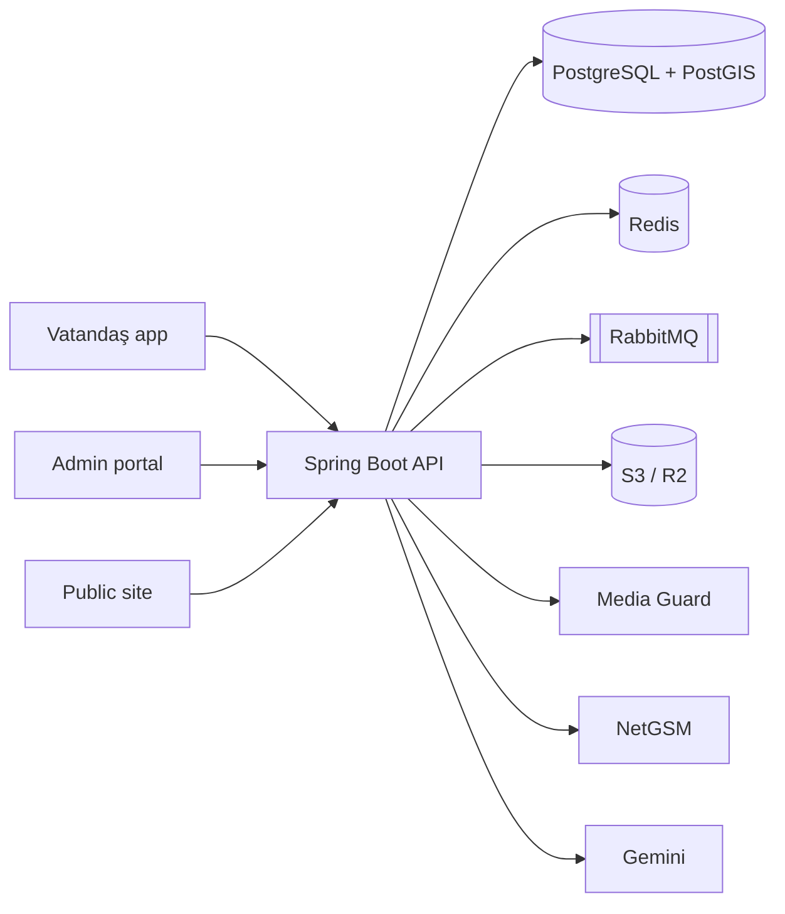

# Kentiva

**Akıllı kent operasyon platformu.**  
Vatandaş ihbar eder, belediye çözer, yönetim ölçer — tek çok kiracılı SaaS.

[](https://spring.io/projects/spring-boot)
[](https://react.dev)
[](https://www.postgresql.org)
[](https://openjdk.org)
[](#lisans)

```
  Vatandaş uygulaması          Yönetim paneli           Platform sahibi
  ─────────────────            ──────────────           ───────────────
  İhbar · konum · medya   →    Atama · SLA · birim  →   Tenant · pilot · sağlık
         │                            │                         │
         └──────────── Spring Boot API + PostGIS + Redis + RabbitMQ ────────────┘
```

---

## Neden Kentiva?

| Sorun | Kentiva yanıtı |
|-------|----------------|
| İhbarlar dağınık kanallarda kaybolur | Mobil + web üzerinden tek akış |
| Belediye ekipleri görünürlükten yoksun | SLA, atama, birim yükü, canlı harita |
| Veri paylaşımı riskli | Tenant izolasyonu, KVKK odaklı medya koruması |
| Pilot ve ölçek ayrı dünya | Aynı kod tabanı, çok kiracılı B2B SaaS |

**Fiyatlandırma (özet):** Başlangıç ₺4.990/ay · Profesyonel ₺9.999/ay · Enterprise teklif · **90 gün ücretsiz pilot**  
Detay: [`sales-package/02-commercial/FIYAT-POLITIKASI.md`](sales-package/02-commercial/FIYAT-POLITIKASI.md)

---

## Uygulamalar

| Uygulama | Klasör | Teknoloji | Rol |
|----------|--------|-----------|-----|
| **Backend API** | [`backend/`](backend/) | Java 21 · Spring Boot · Flyway · PostGIS · pgvector | Kimlik, ihbar, tenant, bildirim, medya |
| **Yönetim paneli** | [`admin-portal/`](admin-portal/) | React · Vite · Tailwind | Belediye operasyon + süper admin |
| **Vatandaş uygulaması** | [`belediyehattı/`](belediyehattı/) | React · Capacitor | İhbar, takip, bildirim (web / Android / iOS) |
| **Kurumsal site** | [`public-site/`](public-site/) | React · Vite | Satış, belediye sayfaları, canlı istatistik |
| **Media Guard** | [`services/media-guard/`](services/media-guard/) | FastAPI · OpenCV | Yüz yoğunluğu kontrolü (prod’da zorunlu) |

---

## Hızlı başlangıç (yerel)

```bash
cp .env.docker.example .env.docker
docker compose --env-file .env.docker up --build
```

| Servis | Adres |
|--------|--------|
| API + Swagger | http://localhost:8080 · `/swagger-ui/index.html` |
| Yönetim paneli | http://localhost:5173 |
| Vatandaş web | http://localhost:3000 |
| Media Guard | http://localhost:8001/health |

Dev süper admin *(yalnızca `dev` profili)*: `admin@kentiva.app` / `admin123`

Ayrıntı: [`DOCKER.md`](DOCKER.md)

Yalnızca backend:

```bash
cd backend
./mvnw spring-boot:run -Dspring-boot.run.profiles=dev
```

---

## Canlıya çıkış

Üretim yolu: **Railway (API + DB + Redis + RabbitMQ)** + **Vercel (portallar)** + **imzalı Android/iOS**.

| Adım | Belge |
|------|--------|
| 1. Yayınlama rehberi | [`deployment/YAYINLAMA.md`](deployment/YAYINLAMA.md) |
| 2. Ortam anahtarları | [`deployment/ANAHTARLAR.template.env`](deployment/ANAHTARLAR.template.env) |
| 3. Prod kontrol listesi | [`deployment/PROD-CHECKLIST.md`](deployment/PROD-CHECKLIST.md) |
| 4. Media Guard deploy | [`deployment/MEDIA-GUARD.md`](deployment/MEDIA-GUARD.md) |
| 5. Rollback planı | [`deployment/ROLLBACK.md`](deployment/ROLLBACK.md) |
| 6. Mağaza listeleme | [`deployment/STORE-LISTELEME.md`](deployment/STORE-LISTELEME.md) |
| 7. Yayın öncesi durum | [`deployment/PROD-ANALIZ-RAPORU.md`](deployment/PROD-ANALIZ-RAPORU.md) |

Doküman dizini: [`deployment/README.md`](deployment/README.md)

> **Önemli:** `SPRING_PROFILES_ACTIVE=prod` olmadan üretim güvenlik kapıları çalışmaz. Setup ve canlı geçişte mutlaka `prod` kullanın.

---

## Mimari (özet)



- **Tenant izolasyonu:** JWT `municipalityId` + AOP + servis katmanı kontrolleri  
- **Güvenlik:** OTP, rate limit, prod secret validator, fail-closed medya  
- **Gözlemlenebilirlik:** `/actuator/health` readiness (`db`, `redis`, `rabbit`, `s3`)

---

## Satış ve sunum

Tek paket: **[`sales-package/`](sales-package/README.md)**

| İçerik | Dosya |
|--------|--------|
| HTML sunum (F11) | [`sales-package/01-pitch/sunum.html`](sales-package/01-pitch/sunum.html) |
| One-pager | [`sales-package/01-pitch/one-pager-tr.md`](sales-package/01-pitch/one-pager-tr.md) |
| Demo senaryosu | [`sales-package/01-pitch/demo-senaryo.md`](sales-package/01-pitch/demo-senaryo.md) |
| Fiyat politikası | [`sales-package/02-commercial/FIYAT-POLITIKASI.md`](sales-package/02-commercial/FIYAT-POLITIKASI.md) |
| Pilot protokol | [`sales-package/02-commercial/pilot-protokol.md`](sales-package/02-commercial/pilot-protokol.md) |
| KVKK ek | [`sales-package/03-compliance/kvkk-veri-isleme-eki.md`](sales-package/03-compliance/kvkk-veri-isleme-eki.md) |
| Tanıtım oynatıcı | [`sales-package/05-media/oynatici.html`](sales-package/05-media/oynatici.html) |

Marka varlıkları: [`marketing-assets/kentiva/`](marketing-assets/kentiva/README.md)

---

## Geliştirme kuralları

AI ve katkı verenler için zorunlu kurallar: [`AGENTS.md`](AGENTS.md)

API sürümleme: [`API-VERSIONING.md`](API-VERSIONING.md)

### Testler

```bash
# Backend
cd backend && ./mvnw test          # Windows: .\mvnw.cmd test

# Admin portal
cd admin-portal && npm run lint && npm run test && npm run build

# Vatandaş uygulaması
cd belediyehattı && npm run lint && npm run test && npm run build

# Public site
cd public-site && npm run lint && npm run test && npm run build
```

CI: [`.github/workflows/ci.yml`](.github/workflows/ci.yml)  
E2E: [`e2e/`](e2e/README.md) · Yük testi: [`scripts/load-test/`](scripts/load-test/README.md)

---

## Güvenlik notu

- Gerçek sırları (`.env`, `ANAHTARLAR.local.env`, keystore, Firebase JSON) **asla** commit etmeyin.
- Üretimde SMS OTP bypass kapalıdır; Swagger kapalı olmalıdır.
- Media Guard yalnızca **iç ağ** üzerinden erişilebilir olmalı.

---

## Lisans

Tescilli B2B SaaS. Tüm hakları saklıdır.
