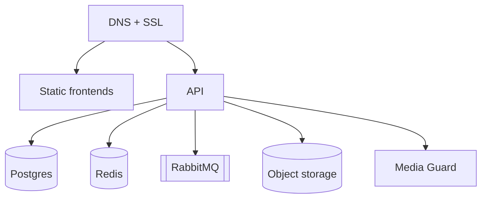

# Kentiva

**Akıllı kent operasyon platformu.**  
Vatandaş ihbar eder · Belediye çözer · Yönetim ölçer — çok kiracılı SaaS.

[](https://spring.io/projects/spring-boot)
[](https://react.dev)
[](https://www.postgresql.org)
[](https://openjdk.org)

```
  Vatandaş uygulaması          Yönetim paneli           Platform sahibi
  ─────────────────            ──────────────           ───────────────
  İhbar · konum · medya   →    Atama · SLA · birim  →   Tenant · pilot · sağlık
         │                            │                         │
         └──── Spring Boot API + PostGIS + Redis + RabbitMQ + S3 ────┘
```

---

## Bu repo kime?

| Rol | Ne yapar? |
|-----|-----------|
| **Geliştirici** | Kod + Flyway + test |
| **Yayınlayan arkadaş** | Anahtarları doldurur, servisleri bağlar — kod yazmaz |

> Sosyal ilanlar (kan / kayıp hayvan / eşya) **v2’ye ertelendi**.  
> Üretim kapsamı: ihbar, SLA, anket, duyuru, ödül, admin/süper-admin, public site.

---

## Uygulamalar

| Uygulama | Klasör | Rol |
|----------|--------|-----|
| Backend API | [`backend/`](backend/) | Kimlik, ihbar, tenant, bildirim, medya, AI |
| Yönetim paneli | [`admin-portal/`](admin-portal/) | Belediye operasyon + süper admin |
| Vatandaş | [`belediyehattı/`](belediyehattı/) | İhbar, takip, anket (web / Android / iOS) |
| Kurumsal site | [`public-site/`](public-site/) | Satış, belediye sayfaları, ihbar takip QR |
| Media Guard | [`services/media-guard/`](services/media-guard/) | Yüz yoğunluğu (prod zorunlu) |

---

## Yayınlama

Adım adım + **servis seçenekleri** + **sıfır kullanıcı maliyet tahmini**:  
**[`deployment/YAYINLAMA.md`](deployment/YAYINLAMA.md)**

| Belge | İçerik |
|-------|--------|
| [`deployment/ANAHTARLAR.template.env`](deployment/ANAHTARLAR.template.env) | Tüm secret şablonu |
| [`deployment/STORAGE.md`](deployment/STORAGE.md) | S3 / R2 / B2 medya |
| [`deployment/MEDIA-GUARD.md`](deployment/MEDIA-GUARD.md) | Media Guard |
| [`deployment/PROD-CHECKLIST.md`](deployment/PROD-CHECKLIST.md) | Go-live |

**Önerilen pilot paket:** Railway (API+DB+Redis+Rabbit+Media Guard) · Vercel (frontends) ·
S3 uyumlu medya · NetGSM · Gemini · Firebase · domain DNS.

Kullanıcı yokken tipik aylık maliyet bandı: **~$40–60** (ayrıntı yayınlama rehberinde).



---

## Yayıncı checklist (özet)

1. `cp deployment/ANAHTARLAR.template.env deployment/ANAHTARLAR.local.env` → doldur  
2. Domain DNS + object storage  
3. API platformu + Postgres/Redis/Rabbit + Media Guard  
4. Frontends deploy + CORS  
5. `/setup` ile süper admin  
6. [`PROD-CHECKLIST.md`](deployment/PROD-CHECKLIST.md)

---

## Yerel geliştirme

```bash
cp .env.docker.example .env.docker
docker compose --env-file .env.docker up --build
```

```powershell
.\scripts\start-local.ps1
```

| Servis | Adres |
|--------|--------|
| API | http://localhost:8080 |
| Admin | http://localhost:5173 |
| Vatandaş | http://localhost:3000 |
| Media Guard | http://localhost:8001/health |

Dev süper admin *(yalnızca `dev`)*: `admin@kentiva.app` / `admin123` — [`DOCKER.md`](DOCKER.md)

---

## Satış

[`sales-package/`](sales-package/README.md) · Kurallar: [`AGENTS.md`](AGENTS.md)

## Lisans

Proprietary — Kentiva.
