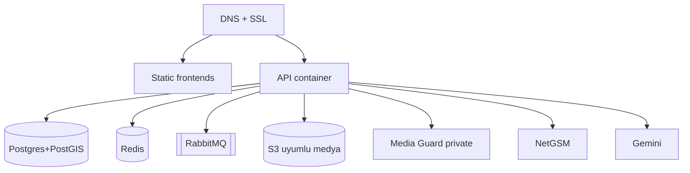

# Kentiva — Yayınlama rehberi

Bu belgeyi **yayınlayan arkadaş** takip eder. Kod yazmaya gerek yok: anahtarları doldur,
uygun servisleri bağla, checklist’i kapat.

- Anahtar şablonu: [`ANAHTARLAR.template.env`](ANAHTARLAR.template.env) → `ANAHTARLAR.local.env` (**commit etme**)
- Media Guard: [`MEDIA-GUARD.md`](MEDIA-GUARD.md)
- Kontrol listesi: [`PROD-CHECKLIST.md`](PROD-CHECKLIST.md)
- Rollback: [`ROLLBACK.md`](ROLLBACK.md)
- S3 uyumlu medya (R2 / AWS / MinIO): [`STORAGE.md`](STORAGE.md)

---

## Servis seçimi (ne nereye?)

Kentiva’nın ihtiyaçları sabit; sağlayıcı serbest. Aşağıdaki **önerilen** set pilot /
sıfır-trafik için en az sürtünmeli kombinasyon. Alternatifler aynı env değişkenleriyle
çalışır.

| İhtiyaç | Önerilen (pilot) | Alternatifler | Neden |
|---------|------------------|---------------|--------|
| API (Spring Boot Docker) | **Railway** | Render, Fly.io, Google Cloud Run, AWS ECS/Fargate, DigitalOcean App Platform | Dockerfile hazır; Postgres/Redis eklentisi kolay |
| PostgreSQL + PostGIS | Railway Postgres (+ PostGIS) | Supabase, Neon (+ PostGIS), AWS RDS, self-host | Flyway + PostGIS zorunlu |
| Redis | Railway Redis | Upstash, ElastiCache, Redis Cloud | Cache + rate-limit |
| RabbitMQ | Railway RabbitMQ | CloudAMQP, Amazon MQ | İhbar sonrası async işler (prod zorunlu) |
| Media Guard (FastAPI) | Aynı platformda **private** servis | Ayrı küçük VPS / Cloud Run (iç ağ) | Public domain **vermeyin** |
| Medya dosyaları (S3 API) | **Cloudflare R2** *veya* **AWS S3** | Backblaze B2, MinIO, DigitalOcean Spaces | Backend `APP_STORAGE_TYPE=s3` |
| Admin / public / vatandaş web | **Vercel** | Netlify, Cloudflare Pages, Railway static | Vite `dist`; root directory ayrı |
| DNS + SSL | Domain sağlayıcı + platform SSL | Cloudflare DNS, Route53, Namecheap | CNAME → Railway/Vercel |
| SMS OTP | **NetGSM** | (Twilio kodda yok — kullanmayın) | Prod validator NetGSM ister |
| AI | **Google Gemini** API key | — | `GEMINI_API_KEY` |
| Push | **Firebase** (FCM) | — | `FIREBASE_CONFIG_BASE64` + `google-services.json` |

**Önerilen uçtan uca pilot paketi:** Railway (API + DB + Redis + Rabbit + Media Guard) +
Vercel (3 frontend) + S3/R2 (medya) + NetGSM + Gemini + Firebase + domain DNS.

Cloudflare zorunlu değildir; yalnızca R2 veya DNS tercih ederseniz [`STORAGE.md`](STORAGE.md)
içinde R2 örneği vardır.

---

## Tahmini maliyet — henüz kullanıcı yokken

Fiyatlar **2026 ortası kamu listelerine dayalı kabaca tahmindir** (USD, aylık, KDV hariç).
Sağlayıcı fiyatları değişir; yayın öncesi panellerden doğrulayın. Amaç: “sıfır ihbar /
sıfır vatandaş” iken sabit fatura bandını görmek.

### Senaryo A — Minimum canlı (önerilen pilot)

Sürekli ayakta prod; trafik ≈ 0; 1 küçük belediye demo / smoke test.

| Kalem | Sağlayıcı örneği | Aylık (yaklaşık) | Not |
|-------|------------------|------------------|-----|
| API + Media Guard compute | Railway Hobby/Pro pay-as-you-go | **$15–35** | 2 container (API + Media Guard), idle düşük |
| PostgreSQL | Railway / yönetilen PG | **$5–15** | Küçük instance; PostGIS |
| Redis | Railway / Upstash free→paid | **$0–10** | Upstash free tier yetebilir |
| RabbitMQ | Railway / CloudAMQP | **$0–10** | En küçük plan |
| Object storage | R2 veya S3 | **$0–2** | Depolama + istek ≈ 0 |
| Frontend (3 proje) | Vercel Hobby | **$0** | Ticari limitlere dikkat; Pro ~$20/üye |
| DNS | Registrar | **$1–2** | Domain yıllık ~$10–15 → aylığa yay |
| SMS NetGSM | NetGSM kredi | **$0–5** | Kullanım yoksa kredi bekler; min paket değişken |
| Gemini API | Google AI | **$0–3** | Free tier / çok düşük çağrı |
| Firebase | Google | **$0** | Spark / düşük FCM |
| **Toplam** | | **≈ $25–80 / ay** | Tipik orta nokta **~$40–55** |

### Senaryo B — Çok kısıtlı staging (geceleri kapatılabilir)

| Kalem | Tahmin | Not |
|-------|--------|-----|
| Tek küçük API + paylaşımlı DB | **$10–25** | Render/Fly free tier’lar kısıtlı; prod profili için uygun değil |
| Frontends | **$0** | Vercel Hobby |
| SMS / AI | **$0** | Key var, çağrı yok |
| **Toplam** | **≈ $10–30** | Soft-launch / yatırımcı demosu; 7/24 SLA yok |

### Senaryo C — “Kurumsal hazır” boş ortam

Ayrı staging + prod, managed backup, gözlem.

| Kalem | Tahmin |
|-------|--------|
| Prod + staging compute/DB | **$80–180** |
| S3 + monitoring + log | **$10–30** |
| **Toplam** | **≈ $90–210 / ay** |

### Maliyeti şişiren / düşüren unsurlar

| Artırır | Düşürür |
|---------|---------|
| 7/24 büyük JVM heap, her zaman sıcak replica | Railway/Render’da sleep (prod için önerilmez) |
| Public Media Guard + ekstra egress | Private iç ağ URL |
| Vercel Pro takım koltukları | Hobby + tek sahip |
| NetGSM yüksek kontör peşin | Kullandıkça kontör |
| Gemini yüksek kota | Sadece key; çağrı yokken ≈ 0 |

**Sonuç:** Kullanıcı yokken Kentiva’yı önerilen pakette ayakta tutmak genelde
**ayda ~$40–60 (≈ ₺1.300–2.000, kura bağlı)** bandındadır. İlk ödeme çoğu zaman
domain + NetGSM min kontör + Railway/Vercel kart doğrulamasıdır.

---

## Hedef mimari (mantıksal)

| Bileşen | Rol |
|---------|-----|
| API | Spring Boot (`prod`), HTTPS |
| PostgreSQL + PostGIS | Flyway, tenant verisi |
| Redis | Cache + rate-limit |
| RabbitMQ | Async ihbar pipeline |
| S3 uyumlu bucket | İhbar medyası (imzalı URL) |
| Media Guard | Private yüz taraması |
| Admin / Public / Citizen web | Vite SPA |
| Android APK | `scripts/build-apk.ps1 -Release` |

Giriş URL’leri (domain’lerinize göre):

- Belediye personeli: `https://admin…/login`
- Platform sahibi: `https://admin…/super-admin/login`
- İlk kurulum (bir kez): `https://admin…/setup` + `APP_SETUP_TOKEN`



---

## 0. Anahtar dosyası

```bash
cp deployment/ANAHTARLAR.template.env deployment/ANAHTARLAR.local.env
```

```powershell
openssl rand -base64 64   # JWT_SECRET
openssl rand -hex 32      # APP_SETUP_TOKEN
[Convert]::ToBase64String([IO.File]::ReadAllBytes("service-account.json"))  # FIREBASE
```

---

## 1. Domain / DNS

1. Domain alın (Namecheap, Google Domains, Cloudflare Registrar, vs.).
2. `api.`, `admin.`, `www.` (veya apex), isteğe `app.` CNAME’lerini
   API ve frontend hostlarına bağlayın.
3. Platformun ürettiği SSL sertifikasını kullanın (Railway/Vercel otomatik HTTPS).

---

## 2. Object storage (medya)

S3 uyumlu bir bucket oluşturun (R2, AWS S3, B2, Spaces, MinIO).

```env
APP_STORAGE_TYPE=s3
S3_ENDPOINT=
S3_ACCESS_KEY=
S3_SECRET_KEY=
S3_BUCKET_NAME=
S3_REGION=auto
S3_PUBLIC_URL=
```

Ayrıntı / R2 örneği: [`STORAGE.md`](STORAGE.md). Bucket’ı public yapmaya gerek yok
(Kentiva imzalı URL kullanır).

---

## 3. Backend platformu (ör. Railway)

1. GitHub repo → deploy (kök [`Dockerfile`](../Dockerfile) / [`railway.json`](../railway.json)).
2. PostgreSQL + Redis + RabbitMQ ekleyin.
3. Media Guard’ı **private** servis olarak ekleyin ([`MEDIA-GUARD.md`](MEDIA-GUARD.md)).
4. `ANAHTARLAR.local.env` Railway Variables’a yapıştırın.

**Minimum zorunlu**

| Değişken | Not |
|----------|-----|
| `SPRING_PROFILES_ACTIVE=prod` | Prod kapıları |
| `JWT_SECRET` / `APP_SETUP_TOKEN` | |
| `APP_PUBLIC_URL` | `https://api…` (imzalı medya) |
| `APP_PUBLIC_SITE_URL` | `https://www…` (QR takip) |
| `APP_CORS_ALLOWED_ORIGINS` | Frontend origin’leri |
| `APP_CACHE_TYPE=redis` + `REDIS_URL` | |
| `APP_MESSAGING_RABBIT_ENABLED=true` + RabbitMQ | |
| `APP_STORAGE_TYPE=s3` + S3_* | |
| `MEDIA_GUARD_URL` | Private iç URL |
| `MEDIA_*_FAIL_OPEN=false` | Üçü de |
| `SMS_PROVIDER=netgsm` + NetGSM | |
| `GEMINI_API_KEY` | Önerilir |
| `FIREBASE_CONFIG_BASE64` | Önerilir |

PostGIS ilk hatada:

```sql
CREATE EXTENSION IF NOT EXISTS postgis;
```

```powershell
.\scripts\check-backend-health.ps1 -BaseUrl "https://api.example.com"
```

---

## 4. Frontends (ör. Vercel)

| Proje root | Env |
|------------|-----|
| `admin-portal` | `VITE_API_BASE=https://api…/api/v1` |
| `public-site` | `VITE_API_BASE`, `VITE_ADMIN_PORTAL_URL`, `VITE_SITE_URL`, `VITE_CITIZEN_APP_URL` |
| `belediyehattı` (opsiyonel) | `VITE_API_BASE_URL=https://api…/api/v1` |

Deploy sonrası CORS’a frontend origin’lerini ekleyin.

### İlk süper admin

1. `https://admin…/setup`
2. `APP_SETUP_TOKEN`
3. Sonra `/super-admin/login`

---

## 5. Android APK

```powershell
.\scripts\build-apk.ps1 -ApiBaseUrl "https://api.example.com/api/v1" -Release
```

- `belediyehattı/android/app/google-services.json`
- İmza anahtarları repo dışında
- [`STORE-LISTELEME.md`](STORE-LISTELEME.md)

---

## 6. Smoke test

1. Super-admin + belediye onboarding  
2. Vatandaş ihbar + fotoğraf  
3. Admin atama / durum / SLA  
4. Public QR takip  
5. Anket + duyuru  
6. Push (cihaz)

Tam liste: [`PROD-CHECKLIST.md`](PROD-CHECKLIST.md)

---

## Yerel geliştirme

```powershell
docker compose --env-file .env.docker up --build
# veya
.\scripts\start-local.ps1
```

Tünel araçları (ngrok vb.) bu repoda yok; staging/prod URL ile test edin.

---

## Sık sorunlar

| Belirti | Kontrol |
|---------|---------|
| Boot reddi | `prod` + Redis + Rabbit + S3 + Media Guard + NetGSM + fail-open=false |
| CORS | `APP_CORS_ALLOWED_ORIGINS` tam HTTPS origin |
| Medya bozuk | S3_* , `APP_PUBLIC_URL` |
| Setup 403 | `APP_SETUP_TOKEN`, henüz süper admin yok |
| WebSocket | Proxy WebSocket desteği açık mı |
