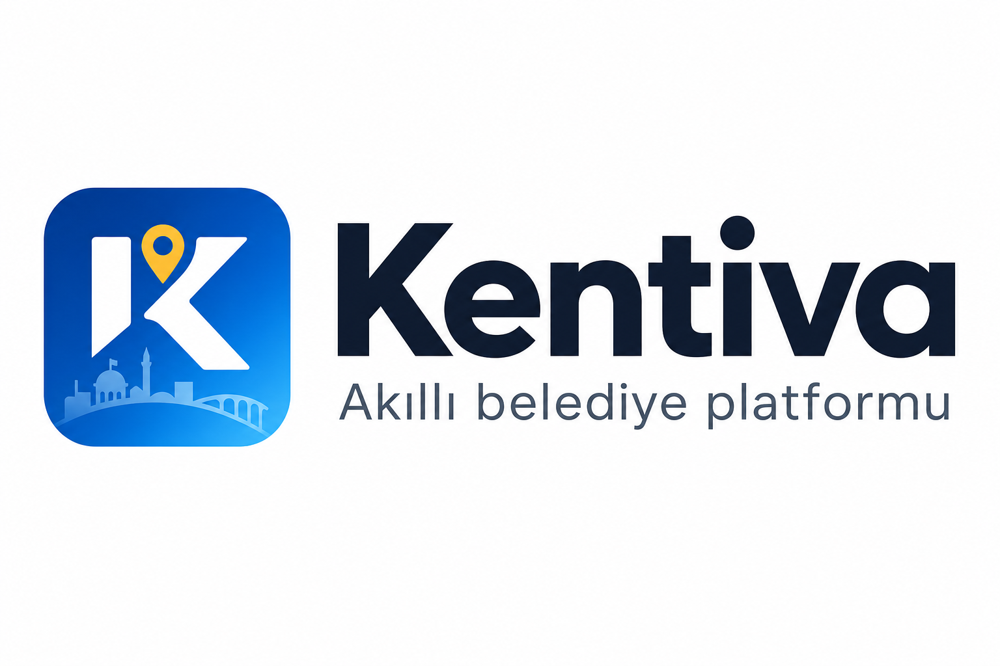

# Kentiva — Tek Sayfa Özet (Belediye)

**Akıllı belediye operasyon platformu** · Vatandaş ihbarı → atama → SLA → şeffaf takip

## Sorun

Bildirimler WhatsApp, telefon ve Excel’de dağılır. Atama belirsiz, SLA görünmez, vatandaş “ne oldu?” diye tekrar arar. Yönetici gerçek zamanlı tablo göremez.

## Çözüm

Kentiva; vatandaş mobil uygulaması + belediye yönetim paneli + KVKK’ya duyarlı medya işleme ile **tek kiracılı güvenli SaaS** sunar.

| Vatandaş | Belediye | Yönetim |
|----------|----------|---------|
| Konumlu ihbar, fotoğraf, durum takibi | Kuyruk, atama, Beyaz Masa, harita | KPI, dışa aktarma, denetim izi |

## Neden Kentiva?

- **Çok kiracılı izolasyon** — Belediye verisi karışmaz
- **Operasyon odaklı** — Rapor listesi, SLA, canlı harita
- **KVKK** — Yüz/plaka maskeleme (Profesyonel+)
- **90 gün ücretsiz pilot** — Risk almadan kanıtlayın
- **MIS uyumu** — Enterprise’da mevcut sistemlere bağlanır

## Fiyat (KDV hariç, aylık)

| Başlangıç | Profesyonel (önerilen) | Enterprise |
|-----------|------------------------|------------|
| ₺4.990 | **₺9.999** | Teklif (başlangıç ₺24.990) |

Yıllık peşin: 10 ay ücreti. Pilot: **90 gün ücretsiz**.

## Sonraki adım

1. Demo talep: **demo@kentiva.app**
2. 90 günlük pilot protokolü
3. Başarı metriklerine göre ücretli plana geçiş

---

*Kentiva · Tescilli B2B SaaS · info@kentiva.app*
